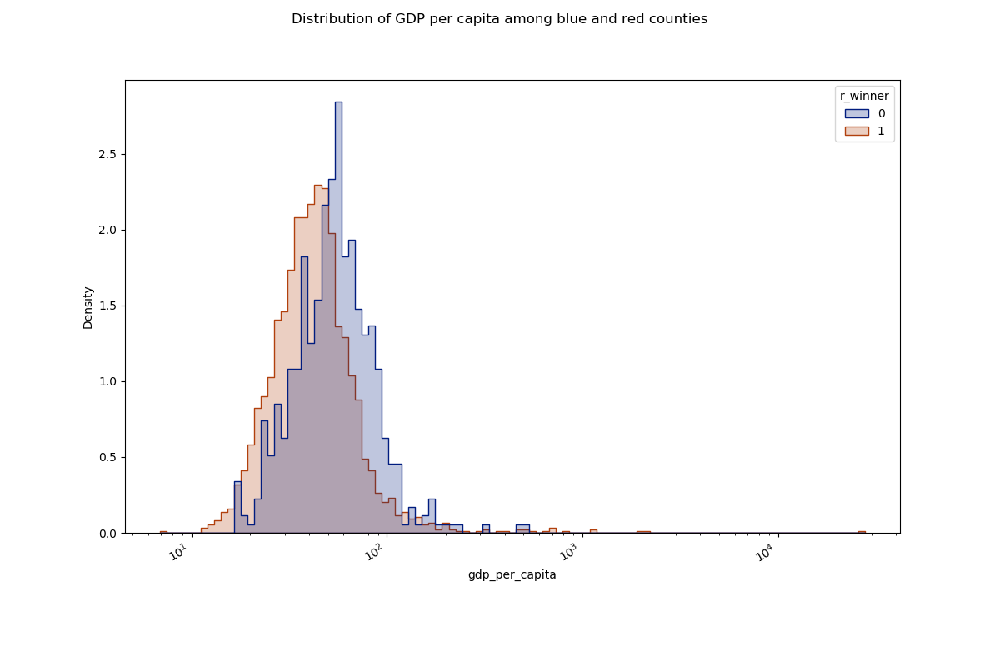

# County-level analysis of GDP and 2020 election results

## Results

### **[Visualizations via Tableau Public - 4 tabs](https://public.tableau.com/app/profile/devon.ankar/viz/UScountiesbyGDPandelectionresults/GDPwinner)**

^ Visit the link for interactive visualizations with text descriptions. Screenshots below:

| | | |
|:--:|:--:|:--:|
||||
|US counties by GDP and winning party in 2020 presidential election|US counties by GDP and winning party in 2020 presidential election - bubble version|US counties by weighted GDP - each county's GDP weighted by its D/R vote share|

| | |
|:--:|:--:|
|||
|US counties by GDP per capita and winning party|Distribution of GDP per capita among blue and red counties|

(Please note that data is not available for all counties.)

**Counties won by each major party**  
d: 512  
r: 2550

**Proportion of GDP accounted for by counties won by each major party**  
d: 0.699  
r: 0.283

**Proportion of GDP accounted for by counties won by each major party, but weighting each county's GDP by its D/R vote share**  
d: 0.498  
r: 0.359

**GDP per capita across counties won by each major party**  
d_median: 53.47  
r_median: 41.16  
d_mean: 60.66  
r_mean: 61.87  
d_standard_deviation: 40.89  
r_standard_deviation: 554.82

^ The distributions of GDP per capita among blue and red counties are different. From these figures, we would expect both distributions to be right-skewed, with a heavier skew for red counties, which is what the histogram shows. Additionally, based on the standard deviations, we would expect a wider distribution for red counties, which is also apparent in the histogram.

[Brookings found that "Biden-voting counties equal 70% of America’s economy"](https://www.brookings.edu/blog/the-avenue/2020/11/09/biden-voting-counties-equal-70-of-americas-economy-what-does-this-mean-for-the-nations-political-economic-divide/). They note that _"2020 figures reflect unofficial results from 99% of counties. Figures for 2020 represent results from 100% of counties for which 2018 GDP data are available."_

The slight difference is probably because my analysis was performed in mid-2021 using certified election results, and I was able to use 2019 GDP data released by the BEA in December 2020 (which was after Brookings completed their analysis).

## Data Sources

***Data from some counties is missing. Data available for only 3063 counties.***

### GDP

Via [BEA - GDP by County, Metro, and Other Areas](https://www.bea.gov/data/gdp/gdp-county-metro-and-other-areas). From [this page](https://apps.bea.gov/regional/downloadzip.cfm), I downloaded the dataset "CAGDP1: GDP Summary by County and MSA". Used 2019 data because 2020 data not available yet. County data was used in this analysis, and GDP is in current-dollar GDP (thousands of current dollars).

### Population

Population estimates from [this page](https://www.census.gov/data/tables/time-series/demo/popest/2010s-counties-total.html): "Datasets" > "Population, Population Change, and Estimated Components of Population Change: April 1, 2010 to July 1, 2019 (CO-EST2019-alldata)"

### Election Results

County-level election returns via [MIT Election Data and Science Lab (MEDSL)](https://dataverse.harvard.edu/dataset.xhtml?persistentId=doi:10.7910/DVN/VOQCHQ)

MIT Election Data and Science Lab, 2018, "County Presidential Election Returns 2000-2020", https://doi.org/10.7910/DVN/VOQCHQ, Harvard Dataverse, V9, UNF:6:qSwUYo7FKxI6vd/3Xev2Ng== [fileUNF]
